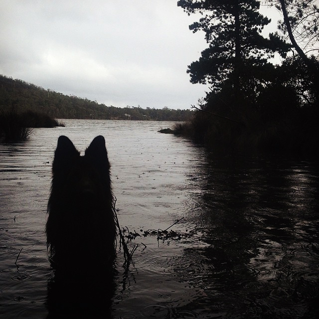

Welcome friend. You have staggered into the dystopian nest of a dysfunctional programmer, song writer, & wild organism from the backwater, ice pit.  
  
At this thin slice of cosmic time writing, I'm living in the woods with Devil (my сat) and spend my days writing, reading, playing guitar and piano, making shit, tryna finish my house, programming, getting fucked up, loosly drifting between other misc interests.  
  
Growing older, it barely even turns my stomach anymore to watch people one by one abandon their ideals & aspirations in exchange for vacancy & channel changing comforts. While each heart must follow its own trajetory, I can't shake the notion that theirs were torn from their chests. May this encourage resistance and inspire your soul.  
  
Moon quit. Moon die.
